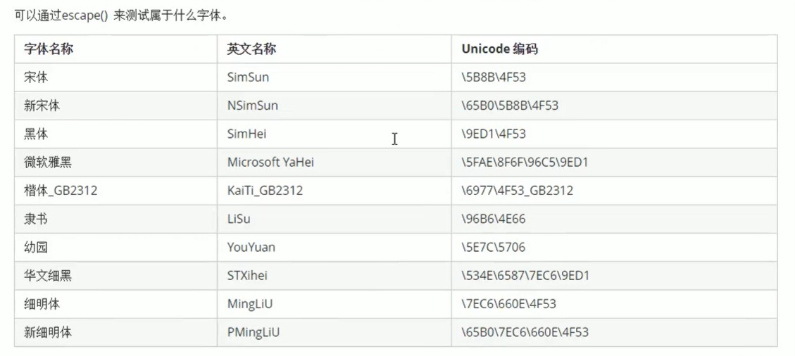

# HTML

## 1. 浏览器的内核

- Trident（IE 内核）
- Gecko（Firefox 内核）
- Webkit（Safari 内核，前 Chrome 内核）
- Chromium/Bink（Chrome 内核）
- Presto（前 Opera 内核）

## 2. Web 标准（w3c 组织）

- 结构标准 xml xhtml
- 样式标准 css
- 行为标准 dom EcmaScript

## 3. HTML 骨架格式

```html
<!DOCTYPE HTML>
<html lang="en">
    <head>
        <meta charset="utf-8"/>
        <title>Title</title>
    </head>
    <body>
    </body>
</html>
```

html4/xhtml 中的字符集：

```html
<meta http-equiv="charset" content="utf-8"/>
```

## 4. HTML 标签

- 标签属性

  格式

  ```html
  <balise key="value">content</balise>
  ```

  ex : 

  ```html
  <hr width="100" color="red"/>
  ```

- 图像标签

  ```html
  
  ```

  - src 图像路径
  - alt 图像不能显示时替换的文本
  - title 鼠标悬停时的文本
  - width 宽度
  - height 高度
  - border 边框宽度

- 链接标签

  ```html
  <a href="">content</a>
  ```

  - herf 跳转目标 "#" => 当前页面
  - target 目标窗口弹出方式
    - self (default)/ _blank

- 锚点定位

  ```html
  <a href="#nameId">content</a>
  <h1 id="nameId">content</h1>
  ```

- Base 标签

  ```html
  <head>
      <!-- a => target -->
      <base target="_blank"/>
  </head>
  ```

- 字符标签

  ```html
  &nbsp; <!-- 空格 -->
  &lt; <!-- < -->
  &gt; <!-- > -->
  &amp; <!-- & -->
  &yen; <!-- ￥ -->
  &copy; <!-- © -->
  &reg; <!-- ® -->
  &deg; <!-- ° -->
  &plusmn; <!-- ± -->
  &times; <!-- ✖ -->
  &divide; <!-- ÷ -->
  &sup2; <!-- ² -->
  &sup3; <!-- ³ -->
  ```

- 无序列表

  ```html
  <ul>
      <li></li>
      <li></li>
      <li></li>
  </ul>
  ```

- 有序列表

  ```html
  <ol>
      <li></li>
      <li></li>
      <li></li>
  </ol>
  ```

- 自定义列表

  ```html
  <dl>
      <dt>title1</dt>
      <dd>content1-1</dd>
      <dd>content1-2</dd>
      <dt>title2</dt>
      <dd>content2-1</dd>
      <dd>content2-2</dd>
  </dl>
  ```

## 5. 表格

- 创建表格

  ```html
  <table width="500" height="500" border="1">
    <thead>
      <tr> <!-- 行 -->
          <th>content</th> <!-- table header -->
          <th>content</th>
          <th>content</th>
      </tr>
    </thead>
    <tbody>
      <tr>
          <td>content</td> <!-- 列（单元格） -->
          <td>content</td>
          <td>content</td>
      </tr>
      <tr>
          <td>content</td>
          <td>content</td>
          <td>content</td>
      </tr>
    </tbody>
  </table>
  ```

  - border 表格的边框 0 -> 无边框
  - cellspacing 单元格与单元格之间的空白间距 default：2
  - cellpadding 单元格内容与单元格边框之间的空白间距 default：1
  - width 表格宽度
  - height 表格高度
  - align 表格在网页中的水平对齐方式 left, center, right

- 表格标题

  ```html
  <table>
      <caption>table title</caption>
  </table>
  ```

- 合并单元格

  跨行合并（从上往下）

  ```html
  <table>
      <tr>
          <td></td>
          <td></td>
          <td rowspan="2"></td>
      </tr>
      <tr>
          <td></td>
          <td></td>
      </tr>
  </table>
  ```

  跨列合并

  ```html
  <table>
      <tr>
          <td></td>
          <td colspan="2"></td>
      </tr>
      <tr>
          <td></td>
          <td></td>
          <td></td>
      </tr>
  </table>
  ```

  删除多余的位置

## 6. 表单

- input 控件

  - text 单行文本
- password 密码
  - radio 单选按钮 通过相同的 name 指定一组单选框
  - checkbox 复选框
  - button 普通按钮
  - submit 提交按钮
  - reset 重置按钮
  - image 图像形式的提交按钮 src
  - file 文件域
  
  name 空间名称

  value 默认文本值

  size 控件在页面中显示宽度

  checked checked 默认被选中的项

  maxlength 允许输入的最多字符

- label 标签

  ```html
  <label>
      <input/>
  </label>
  
  <label for="id">
      <input/>
      <input id="id"/>
  </label>
  ```

- textarea 控件（文本域）

  ```html
  <textarea>content</textarea>
  ```

  - rows 行数
  - cols 每行字符数

- 下拉菜单

  ```html
  <select>
      <option>A</option>
      <option>B</option>
      <option selected="selected">C</option>
  </select>
  ```

- 表单域

  ```html
  <fieldset>
      <legend>title</legend>
      <form action="url" method="post" name="name">
      </form>
  </fieldset>
  ```

## 7. H5 新标签

- header 定义文档的页眉头部

- nav 定义导航链接部分

- footer 定义文档或节的页脚底部

- article 定义文章

- section 定义文档中的节（section，区段）

- aside 定义其所处内容之外的内容侧边

- datalist 定义选项列表，与 input 配合

  ```html
  <input type="" value="" list="namelist"/>
  <datalist id="namelist">
      <option></option>
      <option></option>
  </datalist>
  ```

- fieldset 可将表单内的相关元素分组，打包

  ```html
  <fieldset>
      <legend>title</legend>
  </fieldset>
  ```

- input type

  - email 邮箱格式
  - tel 手机号码格式
  - url url 格式
  - number 数字格式
  - search 搜索框（体现语义化）
  - range 自由拖动滑块
  - time 小时分钟
  - date 年 月 日
  - datetime 时间
  - month 月 年
  - week 星期 年
  - color 颜色

- input 新属性 multiple -> file 其它为 text

  - placeholder 占位符提供描述输入字段预期值的提示信息
  - autofocus 当前页面加载时，input 元素应该自动获得焦点
  - multiple 多文件上传
  - autocomplete 规定表单是否启用自动完成功能，on/off，on 代表记录已经输入的值
  - required 必填项
  - accesskey 规定激活焦点元素的快捷键 alt + 字母

## 8. 多媒体标签

- embed 标签定义嵌入内容

  midi, wav, aiff, au, mp3

  ```html
  <embed src="" />
  ```

  - allowFulScreen
  - quality
  - width
  - height
  - align
  - allowScriptAccess
  - type

- audio 播放音频

  ```html
  <audio src=""/>
  <audio>
      <source src=""/>
      <source src=""/>
  </audio>
  ```

  - autoplay="autoplay" 自动播放
  - controls 是否显示播放控件 默认不显示
  - loop="-1" 循环播放
  - chrome safari ie -> mp3 其他 -> wav

- video 播放视频

  ```html
  <video src=""/>
  <video>
      <source src=""/>
      <source src=""/>
  </video>
  ```

  - autoplay 自动播放
  - controls 是否显示默认播放控件
  - loop 循环播放
  - width 窗口宽度
  - height 窗口高度
  - CSI -> mpeg4 其他 -> webW/ogg

# CSS(Cascading Style Sheets)

## 1. CSS 格式

```css
h1 {
    color:red;
    font-size:25px;
}
```

## 2. 字体样式大小

- font-size 字号大小

  - em 相对于当前对象内文本字体尺寸
  - px 像素
  - in 英寸
  - cm 厘米
  - mm 毫米
  - pt 点

- font-family 字体

  ```css
  font-family: "","","";
  ```

- Unicode 字体

  

- 注释

  ```css
  /* */
  ```

- font-weight 字体粗细 html : b, strong

  - normal 400
  - bold 700
  - bolder
  - lighter
  - \<integer> 100-900 100 的整数倍

- font-style 字体风格 html : em, i

  - normal
  - italic
  - oblique
  
- font 综合设置字体样式

  ```css
  selector{
      font:font-style font-weight font-size/line-height font-family;
  }
  ```

## 3. 选择器

- 标签选择器

  ```css
  HTMLLabel{}
  ```

- 类选择器

  html

  ```html
  <xxx class="a">
  ```

  css

  ```css
  .a{}
  ```

- 多类名选择器

  html

  ```html
  <xxx class="a b">
  ```

  css

  ```css
  .a{}
  .b{}
  ```

- id 选择器

  html

  ```html
  <xxx id="a">
  ```

  css

  ```css
  #a{}
  ```

- id 选择器和类选择器的区别

  id 只能用一次，类选择器可以使用很多次

- 通配符选择器

  ```css
  *{}
  ```

- 伪类选择器

  - 链接伪类选择器

    :link 未访问链接

    ```css
    a:link{}
    ```

    :visited 已访问链接

    :hover 鼠标移动到链接上

    :active 选定的链接

  - 结构（位置）伪类选择器

    :first-child 首个子元素

    ```css
    li:first-child{}
    ```

    :last-child 最后一个子元素

    :nth-child(n) 第 N 个元素，even -> 偶数，odd -> 奇数，n -> 所有，2n -> n[0,...] -> 偶数

    ```css
    li:nth-child(4){}
    li:nth-child(even)
    li:nth-child(n)
    ```

    :nth-last-child(n) 从最后一个元素开始计数

  - 目标伪类选择器

    配合锚点选择器

    ```css
    :target{}
    ```

## 4. CSS 外观属性

- color 文本颜色
  - 预定义值 red / green / blue
  - 十六进制 #FF0000 / #FF6600 / #3c3c3c
  - RGB rgb(0,0,0) / rgb(100%, 0%, 0%)
- line-height 行间距 px / em / %
- text-align 水平对齐方式
  - left / center / right 左中右对齐
  - justify 两端对齐除了最后一行
  - start 对齐开始边界
  - end 对齐结束边界
  - match-parent -> inherit
  - justify-all 最后一行也对齐
- text-indent 首行缩进 em 一个字的距离 / % +-
- letter-spacing 单词间距
- color 颜色半透明 rgba(0, 0, 0, 0)
- text-shadow 文字阴影
  - h-shadow 必须 水平阴影 +-
  - v-shadow 必须 垂直阴影 +-
  - blur 模糊的距离
  - color 阴影的颜色 rgba

## 5. 引入 CSS 样式表

- 内部样式表

  ```html
  <head>
      <style type="text/CSS">
          /* css */
      </style>
  </head>
  ```

- 行内式表

  ```html
  <div style=""></div>
  ```

- 外部样式表

  ```html
  <head>
      <link rel="stylesheet" href=""/>
  </head>
  ```

## 6. 标签的显示模式

- 块级元素 block-level

  用于网页布局和网页结构搭建

  ```html
  <h1>~<h6> <p> <div> <ul> <ol> <li>
  ```

- 行内元素 inline-level

  控制页面中文本的样式

  不能用宽度，高度设置，只能用 margin 和 padding

  只能放行内元素或者文本

  ```html
  <a> <strong> <b> <em> <i> <del> <s> <ins> <u> <span>
  ```

- 行内块元素 inline-block

  可以设置宽，高，对齐属性

  ```html
   <input/> <td>
  ```

- 标签显示模式转换

  - display:inline 块转行内
  - display:block 行内转块
  - display:inline-block 块，行内转行内块

## 7. CSS 复合选择器

- 交集选择器

  html

  ```html
  <p class="a"></p>
  ```

  css（点）

  ```css
  p.a{}
  ```

- 并集选择器

  html

  ```html
  <div></div>
  <span></span>
  <p></p>
  ```

  css（逗号）

  ```css
  div,span,p{}
  ```

- 后代选择器（所有子元素）

  html

  ```html
  <div>
      <p></p>
      <p></p>
      <p></p>
  </div>
  ```

  css（空格）

  ```css
  div p{}
  ```

- 子元素选择器（只选择一级子元素）

  html

  ```html
  <ul class="nav">
      <li>
      	<ul>
              <li></li>
          </ul>
      </li>
      <li></li>
      <li></li>
  </ul>
  ```

  css（大于号）

  ```css
  .nav > li{}
  ```

- 属性选择器

  html

  ```html
  <a href="" title=""></a>
  ```

  css

  ```css
  a[title]{}
  ```

  | 选择器        | 含义                                  |
  | ------------- | ------------------------------------- |
  | E [attr]      | 存在 attr 属性即可                    |
  | E [attr=val]  | 属性值完全等于 val                    |
  | E [attr*=val] | 属性值里包含 val 字符并且在“任意”位置 |
  | E [attr^=val] | 属性值里包含 val 字符并且在“开始”位置 |
  | E [attr$=val] | 属性值里包含 val 字符并且在“结束”位置 |

- 伪元素选择器（CSS3）
  - E::first-letter 文本的第一个单词或字
  - E::first-line 文本第一行
  - E::selection 可改变选中文本的样式
  - E::before 在元素内部的开始位置创建一个元素（行内元素），必须结合 content 属性使用
  - E::after 在元素内部的结束位置创建一个元素（行内元素），必须结合 content 属性使用

## 8. CSS 书写规范

- 空格规范

  - 选择器与 {} 之间必须有空格

  - 属性名与之后的：不允许包含空格，但是：与属性值之间必须包含空格

- 选择器规范

  - 当一个 rule 包含多个选择器时，每个选择器声明必须独占一行
  - 选择器的嵌套层级应不大于 3 级，位置靠后的限定条件应尽可能精确

- 属性规范

  - 属性定义必须另起一行 -> { 后换行
  - 属性定义后必须以分号结尾

## 9. CSS 背景

background-image：背景图片地址

background-repeat：是否平铺

- repeat-x
- repeat-y
- repeat
- no-repeat
- round (css3)
- space (css3)

background-position：背景位置 lcr tcp || Xpx Ypx

- left

- center

- right

- top
- center
- bottom

background-attachment：背景固定还是滚动 scroll | fixed

background-size：背景图像的尺寸大小 px / % / cover 充满 / contain 完整显示

background-origin：背景图像的原点

background-clip：背景图像向外裁剪的区域

background-color：背景颜色 透明：rgba

背景的合写（复合属性）

background：背景颜色 背景图片地址 背景平铺 背景滚动 背景位置

多背景：

background: url(...) no-repeat scroll Xpx Ypx / Lpx Wpx,

​						url(...) no-repeat scroll Xpx Ypx / Lpx Wpx,

​						url(...) no-repeat scroll Xpx Ypx / Lpx Wpx color;

## 10. CSS 三大特性

- 层叠

  如果样式冲突，遵循最终样式的规则

  如果不冲突，就不会相互覆盖

- 继承性

  子标签继承父标签的样式

- 优先级（权重）

  !important 无穷大>行内样式 1, 0, 0, 0>ID选择器 0, 1, 0 ,0>类选择器 0, 0, 1, 0>标签选择器 0, 0, 0, 1

  从单个选择器继承的权重为 0

  ```css
  div{
      color: red!important;
  }
  ```
  1. 使用了 !important 声明的规则
  2. 内嵌在 HTML 元素的 style 属性里面的声明
  3. 使用了 ID 选择器的规则
  4. 使用了类选择器，属性选择器，伪元素和伪类选择器的规则
  5. 使用了元素选择器的规则
  6. 只包含一个通用选择器的规则
  7. 同一类选择器则遵循最后决定原则

## 11. 盒子模型 145

- 盒子边框

  ```css
  border: border-width || border-style || border-color
  ```

  - none：没有边框，忽略所有边框宽度
  - solid：边框为单实线
  - dashed：边框为虚线
  - dotted：边框为点线
  - double：边框为双实线

  表格的细线边框：border-collapse: collapse

  圆角边框：border-radius: 

  外边距：margin

  内边距：padding

## 12. 浮动 182
